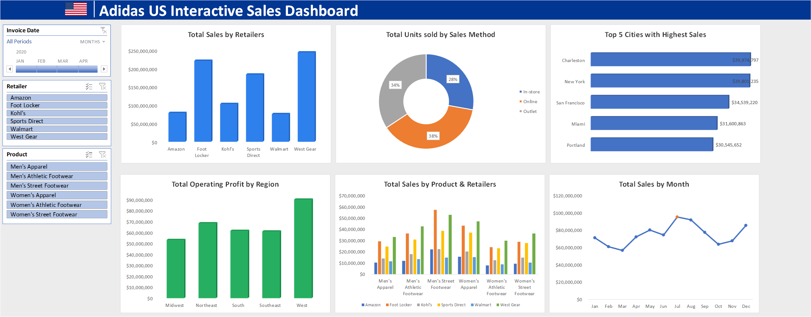
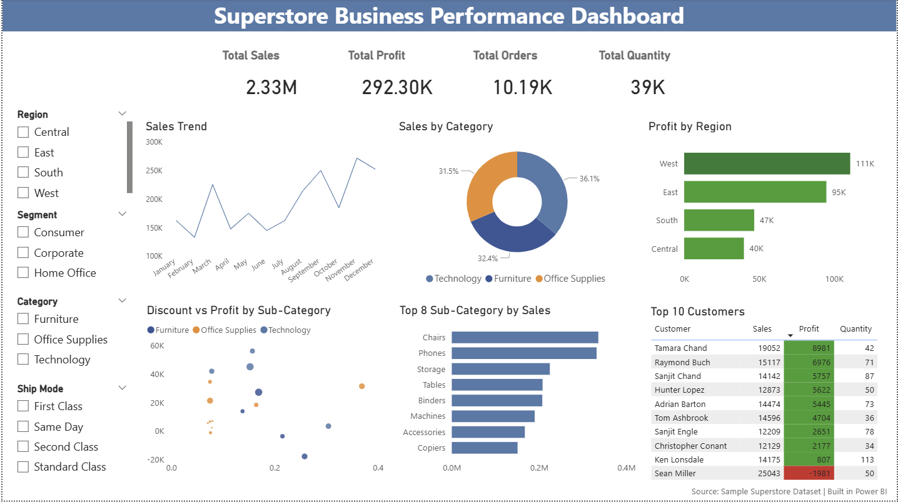

# Project 1

**Title:** [2020 Sale & Profitability Dashboard](https://github.com/samadediran1-hub/github.io/blob/main/2020%20Sales%20Dashbord%20Summary%20Project.xlsx)

**Tools Used:** Microsoft Excel, PivotTables & PivotChats, Slicers and Timeline controls, GETPIVOTDATA for dynamic KPI calculations, Data modeling using structured tables, Custom formatting for professional dashboard design.

**Project Description:** This project focuses on analysing sales data for a cookie company to identify key trends, patterns, and performance insights for the year 2020. The goal was to transform raw data into a clear, interactive dashboard that supports data driven decision making.
The dashboard provides a comprehensive overview of key performance indicators (KPIs), enabling stakeholders to monitor and evaluate business performance across different countries, products, and time periods. The dashboard includes the following features:

Revenue by Country: Displays revenue performance across different markets, highlighting top performing countries.

Profit by Country and Product: Provides a breakdown of profitability by country and cookie type, allowing comparison of product performance across regions.

Units Sold by Month: Shows monthly sales volume trends to identify periods of high and low demand.

Profit by Month: Tracks profitability over time, helping to identify seasonal patterns and peak performance periods.

KPI Summary Cards: Total Revenue, Total Profits, Total Units Sold, Top Performing Country(by revenue).

Additionally, the dashboard includes interactive controls to enhance user experience and enable flexible analysis:

Date Timeline (Month Filter): Allows users to filter data by specific months or date ranges.

Country Slicer: Enables focused analysis of individual or multiple regions.

Product Slicer: Allows drill-down into specific cookie product performance.

**Key findings:** Regional Profitability: Identified the most profitable countries and highlighted regions where performance could be improved and Identified India as the top-performing country in terms of revenue.

Seasonal Trends: Revealed patterns in sales and profit that correspond with seasonal events, allowing for more strategic planning. Observed peak profitability in October.

Top-Performing Products: Highlighted which cookie products are driving the most revenue and profit, aiding in inventory and marketing decisions.

Sales Volatility: Analyzed monthly sales fluctuations to understand market dynamics and adjust business strategies accordingly.

This dashboard serves as a crucial tool for the cookies company’s management team, providing clear, actionable insights that drive informed decision-making and strategic planning.

**Dashboard Overview:** 

# Project 2

**Title:** [Adidas US Interactive Sales Dashboard](https://github.com/samadediran1-hub/github.io/blob/main/Adidas-Dashboard.xlsx)

**Tools Used:** Microsoft Excel, PivotTables & PivotCharts , Slicers and Timeline controls ,Data modelling using structured tables , Data cleaning and transformation, Dashboard layout and UI design principles

**Project Description:** An interactive Excel dashboard developed to analyse Adidas US sales performance, providing insights into revenue, profitability, product performance, and regional trends. The dashboard enables stakeholders to explore key business metrics through dynamic filtering and clear visualisations. 
This project transforms raw transactional sales data into a structured, user-friendly dashboard that supports data-driven decision-making. It provides a comprehensive view of sales activity across retailers, products, regions, and time, allowing users to quickly identify trends and performance drivers.
The solution demonstrates strong capability in data analysis, dashboard design, and business insight generation using Microsoft Excel. Key Features includes;

Total Sales by Retailers: Highlights revenue performance across major retail partners such as Amazon, Foot Locker, and West Gear.

Total Units Sold by Sales Method: Breaks down sales distribution across channels (In-store, Online, Outlet), showing customer purchasing behaviour.

Top 5 Cities by Sales: Displays highest-performing cities, enabling quick identification of key markets.

Total Operating Profit by Region: Compares profitability across regions (Midwest, Northeast, South, Southeast, West).

Total Sales by Product & Retailers: Provides a detailed comparison of product category performance across different retailers.

Total Sales by Month: Shows monthly sales trends to identify seasonal patterns and peak periods. 
The dashboard includes interactive controls to enhance user experience and enable flexible analysis:

Date Timeline (Month Filter): Allows users to analyse performance over specific time periods.

Retailer Slicer: Enables focused analysis of individual or multiple retail partners.

Product Slicer: Allows drill-down into specific product categories.

**Key findings:** 
Identified West Gear as the top-performing retailer in terms of total sales.

Observed peak sales in mid-year (July–August), indicating seasonal demand patterns.

Found regional variation in operating profit, with the West region leading. 

Analysed product category performance to identify high-demand segments.

**Dashboard Overview:**

# Project 3

**Title:** [Superstore Business Preformance Dashboard](https://github.com/samadediran1-hub/github.io/blob/main/Superstore%20Sales%20Summary.pbix)

**Tools Used:** Microsoft Power BI, Data visualisation best practices, Interactive dashboard design, Data modelling using implicit measures

**Dashboard Overview:**

**Project Description:** 
This project presents a one-page interactive business dashboard built using Power BI, based on the Superstore dataset.
The dashboard provides a clear view of sales performance, profitability, customer behaviour, and operational insights, enabling stakeholders to quickly understand business performance and identify key trends.
The objective of this project is to demonstrate data visualisation, dashboard design, and business-focused analysis using Power BI.

*Business Questions Addressed:*

What is the overall sales and profit performance?

Which regions contribute the most profit?

Which product categories drive revenue?

How do discounts impact profitability?

Who are the top-performing customers?

*Dashboard Features*

KPI cards(Performance Overview):
The dashboard includes key performance indicators (KPIs) such as Total Sales, Total Profit, Total Orders, and Total Quantity to provide a high-level snapshot of business performance. These metrics allow users to quickly assess overall performance and identify whether the business is operating efficiently before exploring detailed insights.

Sales trend analysis(Time Based Insight): A line chart is used to track sales performance over time at a monthly level.
This enables identification of trends such as growth patterns, seasonal fluctuations, and sudden changes in performance, supporting better forecasting and planning.

Category level Sales distribution: This helps highlight which categories are driving revenue and where the business should focus its resources.

Regional profit comparison with conditional formatting: This allows quick identification of high-performing regions as well as underperforming areas that may require strategic intervention.

Discount vs Profit relationship (scatter analysis): This provides insight into how pricing strategies impact profit margins, revealing that higher discounts are often associated with reduced profitability.

Sub-category performance breakdown: This enables identification of best-selling products and supports inventory, marketing, and product strategy decisions.

Top 10 customers ranking: Conditional formatting is used to distinguish profitable and loss-making customers, helping identify high-value customers as well as those that may negatively impact profitability.

Interactive slicers: The dashboard includes slicers for Region, Segment, Category, and Ship Mode, allowing users to dynamically filter the data.
All visuals update in real time based on selections, enabling flexible and user-driven exploration of the data without requiring technical expertise.

This project demonstrates the ability to transform raw data into a clear, interactive, and business-focused dashboard, supporting data-driven decision-making.

**Key Insights:**

The West region generates the highest profit contribution.

Technology category drives the largest share of revenue.

Higher discounts are generally associated with lower profitability.

A small number of customers contribute a significant portion of total sales.

