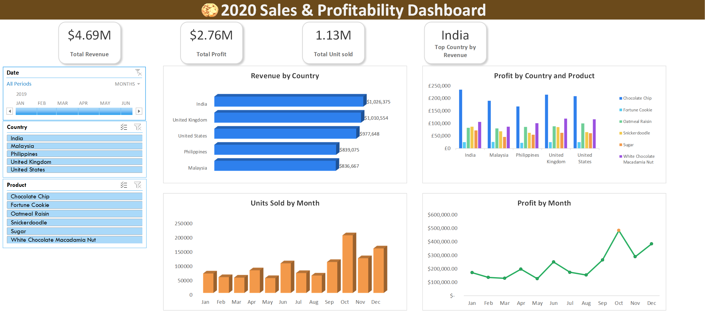

# Project 1

**Title:** [2020 Sale & Profitability Dashboard](https://github.com/samadediran1-hub/github.io/blob/main/2020%20Sales%20Dashbord%20Summary%20Project.xlsx)

**Tools Used:** Microsoft Excel, PivotTables & PivotChats, Slicers and Timeline controls, GETPIVOTDATA for dynamic KPI calculations, Data modeling using structured tables, Custom formatting for professional dashboard design.

**Project Description:** This project focuses on analysing sales data for a cookie company to identify key trends, patterns, and performance insights for the year 2020. The goal was to transform raw data into a clear, interactive dashboard that supports data driven decision making.
The dashboard provides a comprehensive overview of key performance indicators (KPIs), enabling stakeholders to monitor and evaluate business performance across different countries, products, and time periods. The dashboard includes the following features:

Revenue by Country: Displays revenue performance across different markets, highlighting top performing countries.

Profit by Country and Product: Provides a breakdown of profitability by country and cookie type, allowing comparison of product performance across regions.

Units Sold by Month: Shows monthly sales volume trends to identify periods of high and low demand.

Profit by Month: Tracks profitability over time, helping to identify seasonal patterns and peak performance periods.

KPI Summary Cards: Total Revenue, Total Profits, Total Units Sold, Top Performing Country(by revenue).

Additionally, the dashboard includes interactive controls to enhance user experience and enable flexible analysis:

Date Timeline (Month Filter): Allows users to filter data by specific months or date ranges.

Country Slicer: Enables focused analysis of individual or multiple regions.

Product Slicer: Allows drill-down into specific cookie product performance.

**Key findings:** Regional Profitability: Identified the most profitable countries and highlighted regions where performance could be improved and Identified India as the top-performing country in terms of revenue.

Seasonal Trends: Revealed patterns in sales and profit that correspond with seasonal events, allowing for more strategic planning. Observed peak profitability in October.

Top-Performing Products: Highlighted which cookie products are driving the most revenue and profit, aiding in inventory and marketing decisions.

Sales Volatility: Analyzed monthly sales fluctuations to understand market dynamics and adjust business strategies accordingly.

This dashboard serves as a crucial tool for the cookies company’s management team, providing clear, actionable insights that drive informed decision-making and strategic planning.

**Dashboard Overview:** 

